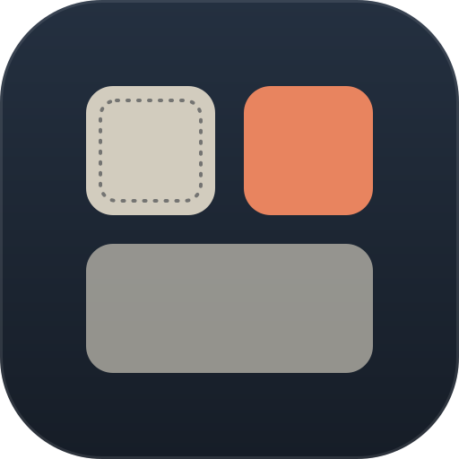

<p align="center">
  
</p>

<h1 align="center">Widgets</h1>

<p align="center">
  <strong>Desktop widgets for Omarchy, in your theme's colors.</strong><br>
  A grid on your wallpaper, arranged by drag and drop.
</p>

<p align="center">
  <a href="#install"></a>
  <a href="https://github.com/anishfn/omarchy-widgets/releases"></a>
  <a href="CONTRIBUTING.md"></a>
  <a href="LICENSE"></a>
</p>

---

## Get it

```bash
omarchy plugin add https://github.com/anishfn/omarchy-widgets.git
omarchy plugin enable io.github.anishfn.widgets
```

That is the whole install. Plugins land disabled so you can read the code
before it runs; `enable` puts the **Widgets** button in your bar and the clock
on your desktop.

| | |
|---|---|
| **Clone URL** | `https://github.com/anishfn/omarchy-widgets.git` |
| **Plugin id** | `io.github.anishfn.widgets` |
| **Requires** | Omarchy 4 (the Quickshell shell) |
| **Update** | `omarchy plugin update io.github.anishfn.widgets` |
| **Remove** | `omarchy plugin remove io.github.anishfn.widgets` |

<sub>Removing the plugin leaves `~/.config/omarchy/widgets.json` alone.</sub>

---

## The widgets

| | | |
|---|---|---|
| **Clock** | The time in any timezone, and how far that is from your own | local |
| **Weather** | Now, today's range, and the condition | `wttr.in` |
| **GitHub** | A year of contributions, as many weeks as the card holds | `github.com` |
| **Repo pulse** | Stars, forks, issues and open PRs; the name opens the repo | `api.github.com` |
| **Music** | What is playing, how far in, and a play/pause button | local (MPRIS) |

```
   ┌─────────┬─────────┐        side: left | right
   │   BLR   │  London │        columns: 1-6
   │  13:15  │   12°   │
   ├─────────┴─────────┤        drag to move
   │ ▪▫▪▪▫▪▪▫▪▪▫▪▪▫▪▪ │        drag to the tray to take one off
   ├─────────┬─────────┤
   │  omara  │ ♪ track │        some widgets span two columns
   └─────────┴─────────┘
```

No account, no telemetry. The clock and the music widget touch nothing outside
your machine. Three widgets do make requests, **each only while it is switched
on**, each to one host and no third party — the table above says which.

---

## Contents

- [What it does](#what-it-does)
- [Install](#install)
- [Turning widgets on and off](#turning-widgets-on-and-off)
- [Arranging them](#arranging-them)
  - [The grid](#the-grid)
  - [Dragging](#dragging)
- [The clock](#the-clock)
- [The weather](#the-weather)
- [The contribution graph](#the-contribution-graph)
- [Repo pulse](#repo-pulse)
- [Music](#music)
- [Config file](#config-file)
  - [The layout block](#the-layout-block)
  - [Each widget](#each-widget)
  - [Widget settings](#widget-settings)
- [Command line](#command-line)
- [Adding a widget type](#adding-a-widget-type)
- [Contributing](#contributing)
- [How it behaves on the desktop](#how-it-behaves-on-the-desktop)
- [Development](#development)

---

## What it does

Draws widget cards on the desktop:

| | |
|---|---|
| **Where** | A grid down the left or right edge, on the Bottom layer — above the wallpaper, beneath every window |
| **Colors** | From the active theme's palette; switching themes re-colors them live |
| **Input** | None, unless a widget asks for it — see [Music](#music) |
| **Space** | Reserves none, and stays inside the area the bar has already claimed |
| **Screens** | Every output by default, or one you name |
| **Network** | Only the weather and GitHub widgets, only while they are on |

Nothing here is a window. You cannot focus a widget or click it — it is
something you see when you clear the screen. Arranging them happens in an
editor of its own, so the widgets themselves never have to take input.

## Install

Everything you need is at the [top of this page](#get-it). Two extra notes:

To install from a **local copy** instead of git, put the folder at
`~/.config/omarchy/plugins/io.github.anishfn.widgets/` and enable the same id.

```bash
omarchy plugin disable io.github.anishfn.widgets   # off, config kept
omarchy plugin remove io.github.anishfn.widgets    # gone
```

## Turning widgets on and off

Click the **Widgets** button in the bar. Every widget in the catalogue gets a
row and a switch; flip one and the desktop follows immediately. The button
dims when nothing is on, so the bar answers "are my widgets up?" without a
click, and its tooltip counts what is showing.

Arrow keys move down the rows, Enter flips the one under the cursor, Escape
closes.

A widget you switch off is off, not gone: its settings stay in the config
file, and switching it back on brings them back — in its old cell if it is
still free, and in the next free one if it is not.

## Arranging them

**Arrange…** in the same popup opens the layout editor: the desktop dims, the
grid appears under your widgets, and you can drag them around. Escape or
**Done** closes it.

### The grid

Widgets sit in a grid of square cells down one edge of the screen, the way the
phone home screens this borrows from lay theirs out. A widget takes a whole
number of cells, so two of them can never half-overlap and a drag has a finite
set of places it can land.

| | |
|---|---|
| **Side** | `left` or `right`. The buttons in the editor, or `side` in the config |
| **Columns** | How many cells wide the grid is, 1–6. Two by default. The buttons in the editor, or `columns` in the config |
| **Cell** | 200px square by default. Widening the grid adds room, it does not shrink what is in it |
| **Spans** | A widget takes one or more columns. The clock is square or double-width |

The grid starts below the bar, not behind it: the surface asks the compositor
for the area the bar has already claimed, so the top row lines up under it on
any bar position.

**Changing the column count** is the **Columns** row of buttons in the editor.
Only counts that actually fit your display are offered — six 200px cells plus
their gaps and margin need 1320px, so a narrower screen is offered fewer. The
count already in use always stays on offer, so a grid configured wider than
the screen can still be narrowed rather than being stuck.

Widening grows the grid away from the edge it is anchored to and leaves every
widget in the cell it was already in — a right-hand grid keeps its right edge
and grows leftward, a left-hand one keeps its left edge and grows rightward.
Narrowing is the only direction that has to move anything: a widget too wide
for the new grid is shrunk to the largest size its type offers that fits, one
hanging off the right edge is pulled back in, and anything that then collides
is repacked in reading order.

### Dragging

- **Move one** — drag it to another cell. The cell you are over lights up in
  the accent color when the drop is legal and in the urgent color when it is
  not, so a refused drop is refused before it happens.
- **Take one off** — drag it down into the tray at the bottom.
- **Put one back** — drag it out of the tray onto a cell.
- **Resize one** — click it, then the size button (`1×1`) in the toolbar. It
  steps through the footprints that widget type offers, and moves the widget
  if the new size does not fit where it was standing.
- **Reshape the grid** — the **Side** and **Columns** buttons change the grid
  itself rather than any one widget.

What decides a drop is the corner of the card you are holding, not the point
of the pointer — the same rule the highlight draws, so the two can never
disagree.

## The clock

The time, large, with two smaller lines:

- **above** — a label you write yourself (`BLR`, `NYC`, anything, or nothing)
- **below** — how far this clock is from your own (`+9:30`), or today's date
  when it *is* your own

Click the clock in the editor and pick a **Timezone** from the searchable
city list — that is the only thing you need to do to turn it into a world
clock, and the label follows the zone unless you write your own. Leave the
timezone empty and it is your own clock with the date under it.

Ask for seconds in the **Format** and it ticks once a second; leave them out
and it wakes once a minute.

The ring of small marks around the edge is decoration. Turn it off with
`"ticks": false`.

## The weather

Where you are, what it is doing, and today's range.

Click it in the editor for **Units** (°C or °F), a **Label** to override the
place name, and whether to show the **high and low**.

### Where it gets the weather

From [wttr.in](https://wttr.in), the same source the rest of Omarchy uses,
and only while a weather widget is on. One request serves every weather
widget on every screen, refreshed every fifteen minutes.

**Location** comes from the file Omarchy already keeps it in, so there is one
place to set it and this plugin never learns your address separately:

```bash
omarchy-weather-location                       # what it is now
omarchy-weather-location --set "Bengaluru"     # set it
omarchy-weather-location --clear               # back to IP auto-detect
```

With nothing set, wttr.in detects the location from your IP address — that is
Omarchy's documented default, not a choice this plugin makes. If you would
rather it not, set a location explicitly.

The condition icon uses the same glyphs `omarchy-weather-icon` picks, and
switches between its day and night forms using the sunrise and sunset at the
place being reported, so a rainy midnight does not get a sun.

If a request fails, the card keeps showing the last reading rather than going
blank — ten-minute-old weather beats no weather.

## The contribution graph

Your GitHub year: seven rows of squares, one column a week, as many weeks
back as the card can hold.

Click it in the editor and set a **Username**. That is the only required
setting; **Legend** turns the scale and week count along the bottom on and
off.

Cell size comes from the height, because seven rows have to fit exactly, and
the number of weeks then follows from the width. So a wide card shows most of
a year and a square one shows a couple of months — the same widget at a
different length, rather than a squashed version of itself. The most recent
week is at the right edge, where you look for it.

The heatmap is the one place in this set where the accent is the data rather
than a detail, so the squares get the whole accent budget and every letter on
the card stays neutral.

### Where it gets the graph

GitHub does not publish the contribution calendar through its REST API, but
the page that draws it is served on its own at `/users/<login>/contributions`
and needs no token. That is the whole source: **github.com directly**, with no
third-party proxy standing between your desktop and it, and no credentials to
set up.

It shows **public contributions**, which is what that page shows. One request
per username, refreshed every half hour, and only while a GitHub widget is on.

## Repo pulse

A repository at a glance: stars, forks, issues, open pull requests, and how
long since anything was pushed to it.

Click it in the editor and set a **Repository** as `owner/name`. **Stars and
issues** turns the figures underneath on and off.

Four numbers and no chart. A sparkline on a card this size says less than the
numbers do — you cannot read a week off it — so the space goes to figures you
can act on. The time since the last push takes the accent, because it is the
one thing on the card that says whether the project is alive.

Each figure is written out — `6 stars`, `0 forks` — rather than shown as an
icon. A star is recognisable, but a fork and an open issue are two small
outlines that look alike at this size, and a bare `0` beside a shape you have
to decode is worse than `0 forks`.

**`issues` is the count with pull requests taken back out of it.** GitHub's
`open_issues_count` includes them, which is a quirk of the API and not what
anybody means by the word — `cli/cli` reports 1076 "issues" of which 66 are
pull requests. Getting that right costs a second request to the search
endpoint; until it answers, the card shows GitHub's combined figure rather
than a wrong smaller one.

**The name opens the repository.** Click it and GitHub opens in your browser
— it underlines and takes the accent colour on hover, so you can see which
part of the card is live. The link uses GitHub's canonical name once it has
been fetched, so a repository that has since been renamed opens where it
actually lives rather than at a redirect.

That makes this the second widget you can click, after [Music](#music). The
whole card is an input region while a widget is interactive, so clicks
anywhere on it are caught — only the name does anything with them.

Data comes from the public REST API, unauthenticated: sixty requests an hour
per address, two per repository every half hour.

## Music

What is playing, from **MPRIS** — so it is whatever is actually playing,
Spotify or a browser tab or mpv, rather than any one application. Album art,
title, artist, a progress bar, and a play/pause button.

**This is one of the two widgets you can click** — the other is
[Repo pulse](#repo-pulse). Every other card here is click-through: the desktop surface has no input region, so a click lands on
whatever is underneath it. A type that needs a control declares `interactive`
in the catalogue and gets *its own rectangle* back, and nothing else changes.
A play/pause you have to go somewhere else to reach is not a play/pause; that
is the whole justification, and it is meant to be a hard one to meet.

Two things follow from widgets living under your windows: the button is only
clickable where no window is covering the card, and it is drawn big enough to
hit without aiming.

**Album art** and **Progress** can each be turned off in the editor. Nothing
here leaves your machine.

### Two shapes, not one stretched

A **wide** card puts the art down the left and the words beside it, with the
elapsed and total times under a progress bar. A **square** card has no room
for that — the art alone would take the whole thing — so the cover fills the
card, the title and artist sit over a scrim along the bottom, and the progress
becomes a hairline at the very edge.

### Which player it follows

Whatever is actually playing, preferring a real player over `playerctld` —
that proxy mirrors the others and lags behind them, so following it is the
difference between a card that changes with the track and one that changes a
moment later. Omarchy's own media widget deprioritises it for the same reason,
and this follows the same rules so the bar and the card agree.

A card is drawn as soon as there is a title **or** an artist, rather than
waiting for both, for the same reason: some players publish one slightly
before the other.

## Config file

`~/.config/omarchy/widgets.json`, created with sensible defaults the first
time the plugin runs. It is watched: save it and the desktop updates. A file
that does not parse is left strictly alone — nothing is overwritten while you
are halfway through an edit — and the reason is logged.

```json
{
  "version": 2,
  "layout": {
    "side": "right",
    "columns": 2,
    "cellSize": 200,
    "gap": 16,
    "marginX": 40,
    "marginY": 40
  },
  "widgets": [
    {
      "id": "blr",
      "type": "clock",
      "enabled": true,
      "monitor": "",
      "col": 0,
      "row": 0,
      "cols": 1,
      "rows": 1,
      "opacity": 0.72,
      "radius": 20,
      "settings": {
        "timezone": "Asia/Kolkata",
        "label": "",
        "format": "HH:mm",
        "ticks": true
      }
    }
  ]
}
```

Add a second entry with a different `id` to get a second widget — several
clocks in different timezones is the obvious one. Values out of range are
clamped rather than rejected and unknown keys are dropped, so a typo costs you
that key and not the file. Two widgets given the same cell are separated, with
the first one in the file keeping the cell it asked for.

A config written for the version before this one — which placed widgets by
anchor and pixel offsets — is migrated rather than discarded: labels,
timezones, colors and rounding all survive, and each widget is given a cell.

### The layout block

| Key | Meaning |
|---|---|
| `side` | `left` or `right`: which edge the grid hugs |
| `columns` | How many cells wide the grid is, 1–6 |
| `cellSize` | The side of one cell in px |
| `gap` | Space between cells |
| `marginX` | Distance from the edge named by `side` |
| `marginY` | Distance from the top of the usable desktop |

### Each widget

| Key | Meaning |
|---|---|
| `id` | Yours, and unique. The name the popup, the editor and the CLI use |
| `type` | Which widget. `clock` is the only one today |
| `enabled` | Whether it is on the desktop. The popup switch writes this |
| `monitor` | Output name (`hyprctl monitors`), or `""` for all of them |
| `col` | Which column it starts in, counting from the grid's left |
| `row` | Which row it starts in, counting from the top |
| `cols` | How many columns it spans. Must be a size the type offers |
| `rows` | How many rows it spans. Must be a size the type offers |
| `opacity` | How solid the card is over the wallpaper, `0`–`1` |
| `radius` | Corner rounding in px, or `-1` to follow Hyprland's `decoration:rounding` |

`radius` defaults to `20` rather than to the theme, because a desktop card is
much larger than the bar chrome that value was chosen for, and a sharp theme
should not square off a 200px card unless you ask it to. Set `-1` if you want
the widget to match your windows exactly.

### Widget settings

#### Clock

| Key | Meaning |
|---|---|
| `timezone` | IANA name, e.g. `Asia/Kolkata`. `""` is your own clock |
| `label` | The small line above the time. `""` follows the timezone — `Asia/Kolkata` becomes `Kolkata` |
| `format` | Qt date/time format. `HH:mm`, `hh:mm AP`, `HH:mm:ss` |
| `ticks` | The ring of marks around the edge |

An unrecognized `timezone` shows `unknown zone` under the time rather than
quietly showing you the wrong hour, and one that is not a plain zoneinfo name
is refused outright.

#### Weather

| Key | Meaning |
|---|---|
| `units` | `celsius` or `fahrenheit` |
| `label` | Overrides the place name. `""` follows the report |
| `showRange` | Today's high and low |

#### GitHub

| Key | Meaning |
|---|---|
| `login` | GitHub username |
| `showLegend` | The week count and the Less–More scale |

#### Repo pulse

| Key | Meaning |
|---|---|
| `repo` | `owner/name` |
| `showStats` | The figures along the bottom |

#### Music

| Key | Meaning |
|---|---|
| `showArt` | Album art |
| `showProgress` | The progress bar and times |

## Command line

The shell owns the config file, so everything goes through it:

```bash
omarchy-shell widgets list          # the grid, and where every widget sits
omarchy-shell widgets json          # the whole config
omarchy-shell widgets enable blr
omarchy-shell widgets disable blr
omarchy-shell widgets toggle blr

omarchy-shell widgets move blr 1 2  # move to column 1, row 2
omarchy-shell widgets place blr 1 2 # same, but switch it on if it was off
omarchy-shell widgets size blr      # step to the next size the type offers
omarchy-shell widgets select blr    # what the editor's controls act on
omarchy-shell widgets set blr timezone Asia/Kolkata
omarchy-shell widgets set blr format 'hh:mm AP'
omarchy-shell widgets side left     # left | right
omarchy-shell widgets columns 4     # 1-6, whatever fits the screen
omarchy-shell widgets edit          # open the layout editor
omarchy-shell widgets done          # close it
omarchy-shell widgets weather       # the current reading
omarchy-shell widgets github        # the fetched graphs
omarchy-shell widgets repos         # the fetched repositories
omarchy-shell widgets reload        # re-read the file now

omarchy-shell shell toggle io.github.anishfn.widgets   # open the bar popup
```

`move` and `place` answer `ok`, or say that the cell is taken or off the grid
— the same judgement the editor's highlight makes. `set` answers with the
value that was actually stored, which is not always the one you sent: a
setting is coerced to the kind its widget declared, so a bad value comes back
as the default rather than being kept.

## Adding a widget type

The catalogue in [`Model.js`](Model.js) is the only place that knows what
widgets exist. Adding one is two steps:

1. Write `widgets/YourWidget.qml`. It is handed `service`, `instance` and
   `card`, and draws into the card it is given.
2. Add an entry to `catalog()` with its `type`, `name`, `description`,
   `source`, the `sizes` it may take as `[cols, rows]` in cells, and a
   `settings` schema.

`settings` is a schema rather than a bag of defaults — each entry says how it
is edited (`text`, `boolean`, `choice`, `timezone`) and what it starts as —
so the editor builds a working settings panel for your widget without knowing
anything about it. Values are coerced to the kind you declared before your
QML sees them, so you never have to defend against a config file.

The bar popup, the editor, the grid and the config validation all read that
one list, so nothing else has to learn the new name. A type added by an update
arrives **switched off**, so upgrading never puts something on your desktop
you did not ask for.

[CONTRIBUTING.md](CONTRIBUTING.md) walks through it properly.

## Contributing

Widgets welcome — [CONTRIBUTING.md](CONTRIBUTING.md) is the how, and
[DESIGN.md](DESIGN.md) is the house style that keeps a hundred contributed
widgets looking like one set.

## How it behaves on the desktop

The desktop surface is layer-shell on `WlrLayer.Bottom` with an empty input
mask and `exclusiveZone: 0`. The editor is a second surface on
`WlrLayer.Overlay` that takes input and the keyboard, and the desktop one
stands down while it is up. In practice:

- widgets are painted over the wallpaper and under every window
- they never take focus, never take a click, and never appear in a switcher
- they do not push your windows around
- they sit inside the space the bar left, so the top row lines up under it
- arranging them happens on the editor's surface, never on theirs

## Development

```bash
node --test tests/          # config, placement and clock math
omarchy plugin validate .   # manifest against the Omarchy schema
dev/preview                 # draw the widgets without the shell (Ctrl-C to stop)
dev/preview --edit          # ...with the layout editor already open
```

`dev/preview` exists because the shell's hot-reload only goes so far: the
plugin registry notices a changed file, but it does not re-instantiate a
panel already mounted with `keepLoaded`, so a code change in the desktop
surface is not visible until `omarchy-restart-shell`. The preview runs a
second Quickshell containing nothing but this plugin's service and surface,
against the same config file, so a widget you are working on appears in
seconds. The bar popup is not part of it — that needs a real bar.

The tests also parse every QML file and check for the two mistakes the QML
engine reports as a plugin that silently fails to appear: a handler set twice
on one object, and a hand-written signal colliding with a property's
generated `<name>Changed`.

[`Model.js`](Model.js) holds every piece of logic that does not need Qt —
the catalogue, config normalization, the grid, and the timezone arithmetic —
which is what lets the test suite run it under plain node.

The drag is in there too, which is the point of it being there. A drag is only
two things that can be wrong: which cell a card at some pixel position is
over, and whether it may land there. Both come out of `dropTarget`, so both
are tested against real pixel coordinates rather than needing a pointer. One
of those tests walks every widget over every cell and asserts that what the
editor's highlight *says* is legal is exactly what the config *does* — the
highlight cannot lie about a drop that would then be refused.

### Why timezones go through `date`

The QML JavaScript engine has no `Intl`, and it accepts the `timeZone` option
on `toLocaleString` and then ignores it — every zone renders as local time,
with no error. So zone offsets are resolved by `date` against the zoneinfo
database, refreshed every fifteen minutes, and applied here as arithmetic.
Zone names are matched against a strict pattern before they reach a command
line, and the lookup names the zoneinfo file directly instead of letting the
C library search for it.

## License

MIT. See [LICENSE](LICENSE).
